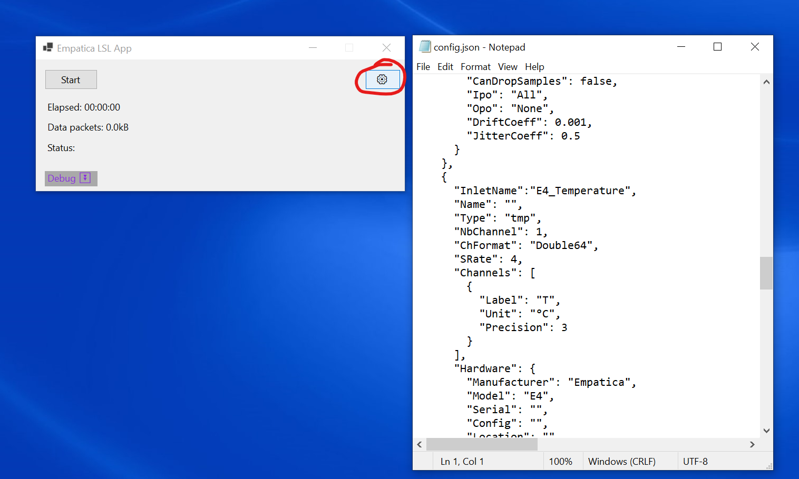

# Goal
AugmentX provides Flanders Make researchers with useful tools and knowledge to support research in human-machine-interaction.
The main goal is to become an internationally recognised centre of excellence w.r.t. providing insight on effort, ergonomics and biomechanical short and longterm risks that physical tasks entail. This allows to assess the effectiveness of physical augmentation devices or compare different solutions to specific industrial problems.   


The short-term goals are:      
- Providing a near real-time data stream of a set or sub set of the available measurement equipment. (in ROS, LSL, ... )     
- Perform measurement capaigns of MOCAP, forces and physiological measurements.     
- Perform standard post-processing on the measured data.

On the long-term, AugmentX aims to get an ISO17025 accreditation wich is a quality label for specific  laboratory services.

---
# Motivation
With the advent of wearable sensory networks and AI-based processing, ergonomics and biomechanical risk assessment is a field that is undergoing an impressive technical revolution.  At the same time, we observe that the interaction between human and machines becomes more intimate in industry 4.0. Biomechanical risk assesment in an industrial context is a complex field in full transition with many opportunities and challenges.

---
# Approach
AugmentX has both a highly accurate laboratory (Research lab @VUB) as well as a less accurate but more nimble and mobile system for on site or heavy load measurment campaigns (Validation & Demonstration lab @Kortrijk). 
Through measurement of forces motion and physiological metrics and making it available in different ways, we provide important support for many research projects. Synchronisation and modular usage of the measurement devices are a major challenge. For each instrument, an application is created to capture and redirect the datastream to Lab Streaming Layer (LSL), where it is synchronised and forwarded or captured for later analysis.

---
# Equipment:
An LSL application exist for each of these equipment:
- Equipment @FM-VUB (Brussels): ErgoFET, Moticon
- Equipment @FM-Intramuros (Kortrijk): Moticon, Captiv, Empatica, Equivital, ErgoPAK, Qualisys
- Auxiliary equipment: Mouse, keyboard, integrated/USB webcam

---
# Software
Each equipment has a corresponding client application which gets the near real-time measurement data from the equipment via equipment APIs or via TCP/UDP streams transmitted by the (usually proprieatary) equipment software. This data is then re-transmitted using LSL library.  DataManager app is used to subscribe, plot, synchronize and record the LSL streams in an integrated way. DataManager can also restream data via `UDP Influx line protocol`. This UDP stream has synchronized data so other applications such as cloud dashboarding application can use it. 


All client LSL applications together with equipment proprietary software is already installed in AugmentX laptop and PCs and ready to be used.  The default local source code directory of the client applications is here: `C:\Code\AugmentX`.
The published applications are located here: `C:\Apps\AugmentX`.

## Synchronization
### How it works:
The equipment timestamps cannot be directly trusted and they are influenced by clock drift, latency and jitter effects: 

Timestamps based on 'data arrival time' are also affected by latency and jitter effects. The periodicity of samples is not guaranteed. But still synchronization can be achieved to a certain extend by a combination of LSL built-in time offset correction function and heuristic algorithms designed to cope with different scenarios, including dropped samples:


Different equipment has unique sample time characteristics with different latency and jitter values and therefore require customization of the synchronization parameters accordingly. Synchronization parameters of the streams are available in the stream metadata. 

## Stream metadata
All LSL streams have a core metadata section which defines the most basic information about that stream. See [here](https://labstreaminglayer.readthedocs.io/projects/liblsl/ref/streaminfo.html?highlight=meta) for more information. 

### Core metadata:

- **name**: Name of the stream. Describes the device (or product series) that this stream makes available (for use by programs, experimenters or data analysts). Cannot be empty.

- **type**: Content type of the stream. The content type is the preferred way to find streams (as opposed to searching by name).

- **channel_count**: Number of channels per sample. This stays constant for the lifetime of the stream.

- **nominal_srate**: The sampling rate (in Hz) as advertised by the data source, if regular (otherwise set to IRREGULAR_RATE).

- **channel_format**: Format/type of each channel. If your channels have different formats, consider supplying multiple streams or use the largest type that can hold them all (such as cf_double64).

- **source_id**: Unique identifier of the device or source of the data, if available (such as the serial number). 

On top of this core section, following stream metadata is defined specifically for AugmentX project: 

### metadata for stream channels:

- **Label**: A label of the channel, i.e. T/Temp/Temperature for a temperature channel
- **Unit**: unit of measurement, i.e. °C, kgf ...
- **Precision**: Number of significant digits for the reading, i.e. for mouse pixel position it is 0. For temperature, it can be 1 for a reading of 27.3°C

### metadata for hardware related information:

- **Manufacturer**: Manufacturer of the hardware 
- **Model**: Model number 
- **Serial**: Serial number 
- **Config**: Any hardware configuration related parameters 
- **Location**: Any location based information, i.e. country of origin or where the equipment is kept (i.e. Kortrijk)

### metadata for synchronization related parameters:

- **TimeSource**: Parameter to define ground truth for the origin of timestamps. Default value is *"Mod0"*. Other values enable original equipment timestamps as the time source and are experimental. 
- **OffsetMean**: Parameter to define the average delay in seconds until an event is recorded with a timestamp by the LSL client. Latency is caused by hw/sw processing and propagation delays. If known and entered here, it can be compansated for. Default value is 0.0
- **CanDropSamples**: A parameter used to signify the possibility of a stream experiencing sample drop, potentially disrupting its regular timing. When this parameter is combined with the "Opo" parameter set to either "Dejitter" or "All," it will generate interpolated samples along with their corresponding timestamps to bridge the gaps caused by dropped samples. This feature becomes essential if the user intends to utilize the LSL dejitter function (configured via the "Ipo" parameter), as the LSL dejitter function is ineffective in the presence of dropped samples.
- **Ipo**: Inlet Processing Options. This parameter allows you to configure how data timestamps are handled during synchronization at the receiving end. In the AugmentX context, this synchronization occurs within the DataManager software application. DataManager will obtain this parameter from a configuration file if it's available for the equipment's client application data stream, or from the metadata streamed together with LSL datastream. The parameter can have the following enumarated values:
	- *None*: No automatic post-processing; return the ground-truth time stamps for manual post-processing. This is the default behavior of the inlet.
	- *Clocksync*: Perform automatic clock synchronization.
	- *Dejitter*: Remove jitter from time stamps. This will apply a smoothing algorithm to the received time stamps; the smoothing needs to see a minimum number of samples (30-120 seconds worst-case) until the remaining jitter is consistently below 1ms. It's important to note that this option is only viable when there are no dropped samples in the data. If your equipment has encountered dropped samples, consult the "CanDropSamples" and "Opo" parameter settings to handle this situation effectively before enabling the "Dejitter" option.
	- *Monotonize*: Force the time-stamps to be monotonically ascending. Only makes sense if timestamps are dejittered.
	- *Threadsafe*: Post-processing is thread-safe (same inlet can be read from by multiple threads); uses somewhat more CPU.
	- *All*: The combination of all possible post-processing options.

> More information on LSL time synchroniztion parameters can be found [here](https://labstreaminglayer.readthedocs.io/projects/liblsl/ref/enums.html#_CPPv424lsl_processing_options_t)

> More information on how LSL time synchronization algorithm works can be found [here](https://labstreaminglayer.readthedocs.io/info/time_synchronization.html).

- **Opo**: Outlet Processing Options. This parameter enables you to customize the way data timestamps are processed within client applications. These applications read real-time equipment streams, process the data based on the Opo parameter, and then convert and transfer this data as LSL datastreams. The parameter can have the following enumarated values:
	- *None*: No automatic post-processing; return the ground-truth time stamps for manual post-processing. This is the default behavior of the outlet.
	- *Monotonize*: Experimental parameter to monotonize equipment originated timestamps. Default disabled. 
	- *Dejitter*: This parameter is used to rectify timestamp irregularities caused by jitter, and it's applicable when the TimeSource is set to Mod0 or Mod2 (considered experimental). It also facilitates the interpolation of missing samples when CanDropSamples is set to "true." This algorithm determines whether to insert interpolated values when the time gap between timestamps exceeds a specific threshold defined by JitterCoeff multiplied by the Sample Period. Exercise caution when adjusting this parameter. Dejitter function should only be enabled  when the level of jitter is significantly lower than the signal period. Otherwise, there is a risk of misinterpreting signal jitter as dropped samples and introducing interpolated data inaccurately.
	- *Ets4Dsr*: Experimental parameter. Use equipment timestamps for dropped samples detection and recovery for Mod0.
	- *All*: Enable all outlet processing options at once, including experimental ones! Default disabled.
- **DriftCoeff**: An experimental parameter with a default value of 0. It calculates and compensates for any drift between the timestamp when the data arrives and the timestamp when it's processed using the Opo parameters.
- **JitterCoeff**: The parameter that tells Dejitter when to add interpolated values.  When the time gap between timestamps exceeds the threshold set by JitterCoeff times the Sample Period, Dejitter decides whether to insert interpolated data. 

## Configuration files

Most of the client applications load their metadata from their `config.json` file whereas few other  applications' metadata is hard-coded. This file resides next to the application executable. The contents of this file can be directly displayed by clicking `settings` button at the right corner of the application window. An example is shown below for Empatica LSL application:


A segment of a Empatica smartwatch config file (json) shown below with  its streamer carrying temperature data. A few of these parameters are used for device configuration while most of the remaining ones are transferred as stream's metadata:

```json
"InletName":"E4_Temperature",
"Name": "",
"Type": "tmp",
"NbChannel": 1,
"ChFormat": "Double64",
"SRate": 4,
"Channels": [
{
	"Label": "T",
	"Unit": "°C",
	"Precision": 3
}
],
"Hardware": {
"Manufacturer": "Empatica",
"Model": "E4",
"Serial": "",
"Config": "",
"Location": ""
},
"Sync": {
"TimeSource": "Mod0",
"OffsetMean": 0.1,
"CanDropSamples": false,
"Ipo": "All",
"Opo": "None",
"DriftCoeff": 0.001,
"JitterCoeff": 0.5
}
```

When the DataManager application subscribes to a client application's stream for the first time, it creates a configuration file using stream's metadata. This file is placed in the "config" folder, located in the same directory as the DataManager executable. If the received metadata is incomplete or absent, except for core metadata, the DataManager creates the config file with default parameters and their values.

From this point forward, the config file becomes the definitive source of metadata for that stream. It will not be automatically overwritten by any changes in the stream's metadata. Users have the option to modify this config file to suit their specific requirements. Once they are satisfied with the configuration, it is highly recommended that they update the equipment-specific config files in the client application's remote repositories to make these changes permanent.

If a user wishes to replace the config file with the metadata received from the stream, they must delete the existing config file to achieve this.


## Publishing apps:
To publish C# projects, use terminal and `dotnet publish` command with set of arguments to publish it framework independent single file executable.

Here is an example for DataManager: 
```bash
dotnet publish -r win-x64 -f net6.0-windows /p:PublishSingleFile=true /p:IncludeNativeLibrariesForSelfExtract=true --self-contained true --output C:\Apps\AugmentX\DataManager
```
In the resulting folder, remove `*.pdb` files which are used for debugging before relasing the app to Github. 

> **Note:**  Recommended way to do this automatically for all dotnet projects: Simply use `publish-all.bat` under `.utils` folder. If you add a new client application, ensure to change this file to include the new client app for publishing. 

## Working with Git & GitHub:
There are two main repositories (aka superrepo): one for [VUB-AugmentX](https://github.com/Augment-X/AugmentX.git) and one for [FM Intramuros](https://github.com/Flanders-Make-vzw/AugmentX.git).  These superrepos are maintained and synched with each other. They also contain client applications which are also maintained and synched to each host.

### Way of working: 

#### Cloning 

```bash
# For Flanders Make Intramuros
git clone https://github.com/Flanders-Make-vzw/AugmentX.git --recursive 

# For VUB AugmentX
git clone https://github.com/Augment-X/AugmentX.git --recursive  
```
After the clone, all submodules are in detached state, so proceed with below command to bring them back to main or master branches (or the branch name defined under .gitmodules):
```bash
git submodule foreach -q --recursive 'git checkout $(git config -f $toplevel/.gitmodules submodule.$name.branch || echo main || echo master)'

# And confirm all submodules are on a branch with:
git submodule foreach git branch -v
```

#### Making changes 

1. Before making changes, first ensure to pull in changes from remote:
```bash
git pull --recurse-submodules=on-demand --rebase origin main
```

In this command:
- `--recurse-submodules=on-demand` tells Git to recursively update submodules only when needed.
- `--rebase` instructs Git to rebase your local changes on top of the updated branch from the remote repository.
- `origin` specifies the remote repository.
- `main` is the branch you want to pull and rebase from the remote repository.

Make sure you are in the right directory in your Git repository when you run this command.

2. Once you make modifications to a submodule and commit & push to its repository, the reference of that commit should be updated in the superrepo as well. Otherwise superrepo will point to an older commit of the submodule. You can do both of these in one step with:
```bash
git push --recurse-submodules=on-demand origin main
```
This command pushes your changes to the main branch in the main repository and any changes within submodules that have been modified.If you haven't made any changes in a submodule, it won't push for that submodule.


##### Some guidelines for committing:
1. For the sake of traceability, for each meaningful change / feature update, create a commit. 
2. Keep comments short (less than 150 characters total)
Committing fewer changes at a time can help with this
3. Use the imperative mood
4. Use Title case (i.e. "Add Logging" instead of "add logging")
5. Add a body (optional)
Less than 100 characters
Explain WHAT the change is, but especially WHY the change was done


#### Keeping two main repos (VUB + FM intramuros) in synch
Two main repos and their submodules **will be udpated independently** and **will be diverging** unless its being synched from time to time. 

Synch can only be achieved by people who have access to both repositories.
To make life easier for the person who performs synch operation, a way of working is defined with some tweaks made to local repository git configuration. 

##### Tweaks:
1. Add VUB main repo  path (assuming `origin` is FM Intramuros):
```bash
# To pull and push ext:
git remote add ext https://github.com/Augment-X/AugmentX.git 

# To automatically push to second remote while pushing to origin:
git remote set-url --add origin https://github.com/Augment-X/AugmentX.git 
```
2. Add VUB submodules paths, for each submodule:
```bash
#i.e. for CameraCapture: 
# pull and push to ext
git remote add ext https://github.com/Augment-X/CameraCapture_lsl_app.git 

# To automatically push to second remote while pushing to origin:
git remote set-url --add origin https://github.com/Augment-X/CameraCapture_lsl_app.git
```

Same tweak can be done directly on the submodule config file (SuperRepo\.git\modules\apps\CameraCapture\config): 
```bash
[core]
	repositoryformatversion = 0
	filemode = false
	bare = false
	logallrefupdates = true
	symlinks = false
	ignorecase = true
	worktree = ../../../../apps/CameraCapture
[remote "origin"]
	url = https://github.com/Flanders-Make-vzw/CameraCapture_lsl_app.git
	fetch = +refs/heads/*:refs/remotes/origin/*
	url = https://github.com/Augment-X/CameraCapture_lsl_app.git
[branch "main"]
	remote = origin
	merge = refs/heads/main
[submodule "libs/libfmax-Csharp"]
	active = true
	url = https://github.com/Flanders-Make-vzw/libfmax-Csharp.git
[remote "ext"]
	url = https://github.com/Augment-X/CameraCapture_lsl_app.git
	fetch = +refs/heads/*:refs/remotes/ext/*
```

##### Synch process:
1. First pull in and rebase changes
```bash
# Pull in origin and submodules:
git pull --recurse-submodules=on-demand --rebase origin main

# Pull in ext main and submodules (two steps):
git pull --rebase ext main
git submodule foreach git pull --recurse-submodules=on-demand --rebase ext main
```
***Optional**: Fetch and check commits (for example, before a pull and rebase) with:*
```bash
git remote update
git branch -vva
```

2. Push changes 

Nicely with:
```bash
# Push to origin and submodules:
git push --recurse-submodules=on-demand origin main

# Push to ext main and submodules (two steps):
git push ext main
git submodule foreach git push --recurse-submodules=on-demand ext main
```

Forcefully with: `-f` flag at the end of push commands
> **Warning:**  `-f` will overwrite the commit history!

### Side notes: 
#### How super-repo was built
In building up the super repo, these steps were followed:  

1. Start with main repo files (i.e. utils, resources, readme...)
2. Initialize git
```bash
git init
git branch -m main
git remote add ext https://github.com/Augment-X/AugmentX.git
git remote add origin https://github.com/Flanders-Make-vzw/AugmentX.git
git add .
git commit -m "First commit"
```

3. Add submodules:
```bash 
git submodule add https://github.com/Flanders-Make-vzw/AugmentX_Dashboard.git   apps/AxDashboard 
git submodule add https://github.com/Flanders-Make-vzw/CameraCapture_lsl_app.git  apps/CameraCapture 
git submodule add https://github.com/Flanders-Make-vzw/CaptivClient_lsl_app.git     apps/CaptivClient 
git submodule add https://github.com/Flanders-Make-vzw/DataManager_lsl_app.git   apps/DataManager 
git submodule add https://github.com/Flanders-Make-vzw/EmpaticaClient_lsl_app.git  apps/EmpaticaClient 
git submodule add https://github.com/Flanders-Make-vzw/EquivitalClient_lsl_app.git  apps/EquivitalClient    
git submodule add https://github.com/Flanders-Make-vzw/ErgoPak_lsl_app.git    apps/ErgoPak 
git submodule add https://github.com/Flanders-Make-vzw/KeMoStreamer_lsl_app.git  apps/KeMoStreamer 
git submodule add https://github.com/Flanders-Make-vzw/Qualisys_lsl_app.git   apps/QualisysClient  
git submodule add https://github.com/Augment-X/ErgoFet.git apps/ErgoFet    
git submodule add https://github.com/Augment-X/MoticonClient.git apps/MoticonClient  

# Initialize and update submodules. Note with '--recursive' flag submodules of submodules are also pulled in:
git submodule update --init --recursive
```

4. Modify `.gitmodules` file, converting absolute paths to relative: 
```bash
[submodule "apps/AxDashboard"]
	path = apps/AxDashboard
	url = ../AugmentX_Dashboard.git
[submodule "apps/CameraCapture"]
	path = apps/CameraCapture
	url = ../CameraCapture_lsl_app.git
[submodule "apps/CaptivClient"]
	path = apps/CaptivClient
	url = ../CaptivClient_lsl_app.git
[submodule "apps/DataManager"]
	path = apps/DataManager
	url = ../DataManager_lsl_app.git
[submodule "apps/EmpaticaClient"]
	path = apps/EmpaticaClient
	url = ../EmpaticaClient_lsl_app.git
[submodule "apps/EquivitalClient"]
	path = apps/EquivitalClient
	url = ../EquivitalClient_lsl_app.git
[submodule "apps/ErgoPak"]
	path = apps/ErgoPak
	url = ../ErgoPak_lsl_app.git
[submodule "apps/KeMoStreamer"]
	path = apps/KeMoStreamer
	url = ../KeMoStreamer_lsl_app.git
[submodule "apps/QualisysClient"]
	path = apps/QualisysClient
	url = ../Qualisys_lsl_app.git
[submodule "apps/ErgoFet"]
	path = apps/ErgoFet
	url = ../ErgoFet.git
[submodule "apps/MoticonClient"]
	path = apps/MoticonClient
	url = ../MoticonClient.git
```
	
5. Commit and push changes (with force flag(-f), in case we are overwriting existing remotes)
```bash
git add .
git commit -m "Add submodules"
git push -u origin main --recurse-submodules=on-demand -f
git push -u ext main --recurse-submodules=on-demand -f
```


#### Guidelines for releasing in Github:
1. For a new release, define a version number using https://semver.org/
2. [Publish your apps](#publishing-apps)
2. Attach your published app (executables, config files etc.) to the release assets

# Acknowledgments

The development of the **PhysioSense** framework was supported by the following projects:

- Financial support from **Flanders Make** through the INFRA project **[AugmentX](https://augmentx.be/)**.
- The European Union's Horizon 2020 research and innovation program under Grant Agreements No. 871237 (SOPHIA) and 101070596 (euROBIN).
- The **Flanders Make** SBO projects **Wellficiency** and **Autocraft**.
  
---
# Contact
augmentx@flandersmake.be 


