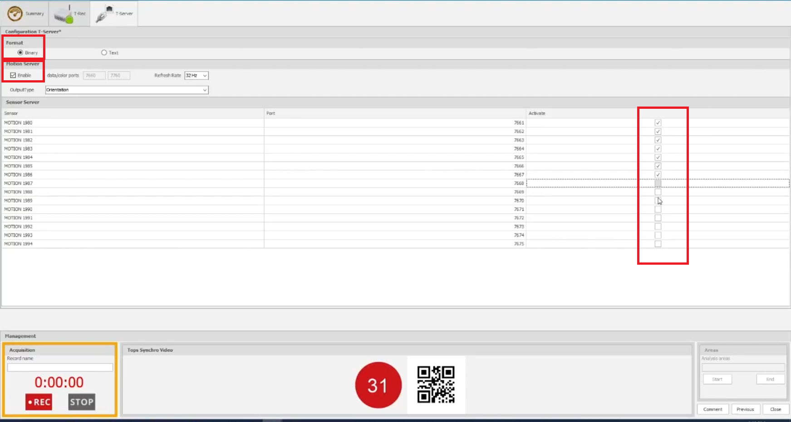

## Description

Reads stream from Captiv software and creates an LSL outlet with the data.
- Tested with CAPTIV version: 202.4.42 Beta. Located at: https://www.dropbox.com/s/xdysdz7pwsvzsu7/CAPTIV%202.4.42%20Full.exe?dl=1
- ⚠ Older version can have issue with limb position streams. 

---
## Issues & Todos: 
> **BUG** with TEA FSR sensors: They do not send clean data (timestamps are sometimes non-monotonous). There are also dropped samples. But all these issues are compensated by our client software. 

> **BUG** with Captiv: Sometimes Captiv software does not stream data from some of its sensors even though sensor TCP is connected

> **TODO**: At the moment only binary streams supported. ASCII support can be added. 

---
## User Guide

This user guide provides an overview of the CaptivClient software application and how to use it.

### Getting Started

1. Launch Captiv application from TEA Ergo  

2. Configure & calibrate the sensors attached: 
- Check `binary` checkbox for the format
- If it is the motion server being streamed, choose output type (orientation  / position) and click on `enable` checkbox
- If any other sensor needs to be streamed, ensure to enable them by checking their corresponding checkbox. 

It should look like this:

3. Launch the CaptivClient application.

### Application Controls
The CaptivClient application has several controls for managing data streaming and configuration:

#### Starting/stopping LSL data stream
On the LSL client application:
- Click the "Start" button to begin LSL data streaming.
- During streaming, the "Start" button will change to "Stop". Click it again to stop data streaming.

#### Settings Button
- Click the "Settings" button to open the configuration file (config.json) in Notepad.
- Edit the configuration file as needed and save your changes.
- Close Notepad to return to the CaptivClient application.

#### Debug Area
- Click the "Debug ⏬" label to expand or collapse the debug area.
- The debug area contains a text box (tbConsole) to display application messages and a text box (tbCommand) for entering commands.

#### Data Logging Checkbox
- Check the "Enable Log" checkbox to save the streamed data to a file when stopping the data streaming.

#### Sending commands manually
1. Click the text box in the debug area where there is already a command "TEAStopRec".
2. Type your own command and press Enter to send the command to Captiv software.
3. The command history can be navigated using the Up and Down arrow keys.

#### Status Information
During operation, the CaptivClient application displays status information:
- Elapsed Time: Shows the elapsed time since data streaming started.
- Data Packets: Shows the amount of data received in kilobytes (kB) or megabytes (MB).
- Status: Shows the current status of the application, including any critical events or errors.

