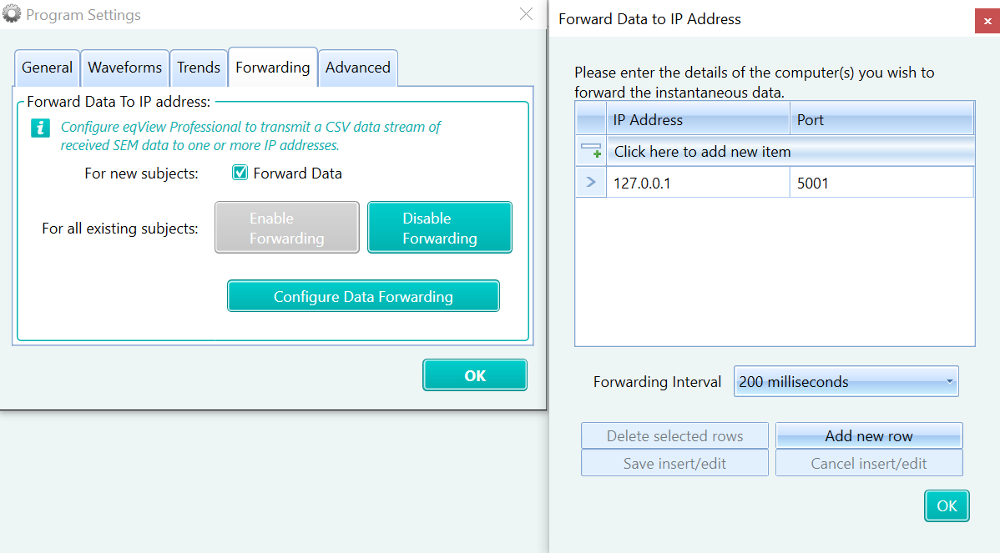

## Description
Reads stream from Equivital software and creates an LSL outlet with the data.

---
## Issues & Todos: 
> **TODO**: SDK has been purchased and not implemented. With the SDK, there is no need to run eqView Professional to access the sensor data.

> **TODO**: Equivital streams alarm codes. If needed, those can be displayed in client application interface. 

---
## Data Stream
- ECG, ECG waveforms, HR, R-R interval
- Respiratory rate and respiratory waveforms
- Skin temperature
- Galvanic skin response
- Core temperature capsule/Dermal patch*
- Accelerometer, X,Y,Z, Activity
- Body position/Movement
- Oxygen saturation*
- Blood pressure*

* Measured using a compatible ancillary sensor

---
## Configuration
eqView Professional should allow port forwarding of sensors data. This is configured with:

---
## User Guide

This user guide provides an overview of the EquivitalClient software application and how to use it.

### Getting Started
1. Launch eqView Professional application
2. Power up Equivital sensors and wait for connection
3. Launch the EquivitalClient application.

### Application Controls
The EquivitalClient application has several controls for managing data streaming and configuration:

#### Starting/stopping LSL data stream
On the LSL client application:
- Click the "Start" button to begin LSL data streaming.
- During streaming, the "Start" button will change to "Stop". Click it again to stop data streaming.

#### Settings Button
- Click the "Settings" button to open the configuration file (config.json) in Notepad.
- Edit the configuration file as needed and save your changes.
- Close Notepad to return to the EquivitalClient application.

#### Debug Area
- Click the "Debug ⏬" label to expand or collapse the debug area.

#### Data Logging Checkbox
- Check the "Enable Log" checkbox to save the streamed data to a file when stopping the data streaming.

#### Status Information
During operation, the EquivitalClient application displays status information:
- Elapsed Time: Shows the elapsed time since data streaming started.
- Data Packets: Shows the amount of data received in kilobytes (kB) or megabytes (MB).
- Status: Shows the current status of the application, including any critical events or errors.

