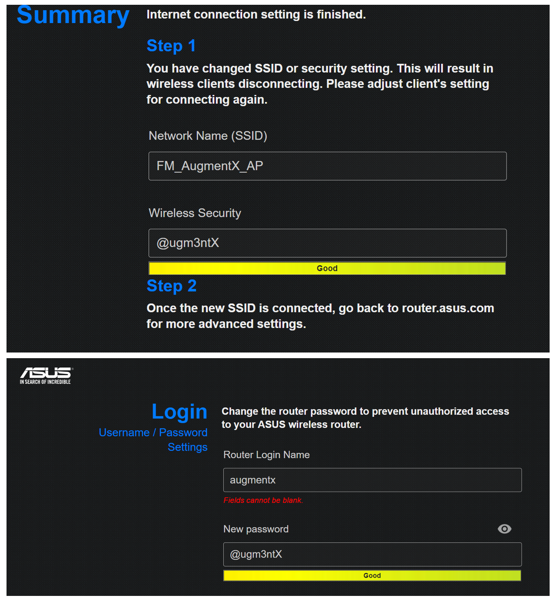

## Description
Reads stream from Moticon insole software and creates an LSL outlet with the data.

---
## Configuration

A wireless LAN has to be setup to connect mobile device to the PC. Communication port used by Motican OpenGo application (9999) should be allowed by the firewall of connected devices and access point.

Access point available in FM Kortrijk has been configured with following settings:

---
## User Guide

This user guide provides an overview of the MoticonClient software application and how to use it.

### Getting Started
1. Power up insoles 
2. Power up mobile device which hosts Moticon OpenGo application and ensure its bluetooth and wifi are both enabled
3. Power up access point and ensure mobile device and PC where client application will run is connected to its network
4. Launch Moticon OpenGo application on the mobile device and connect to the insoles
5. Go to settings on the app and ensure that connections settings are entered correctly, IP address is pointing to the PC with Moticon OpenGo PC application and LSL client application. 
6. Start Motion OpenGo on the PC and go to settings and enter the IP address of the PC, if it is not already entered. At the same settings page also ensure that Port ON checkbox is checked.
7. Go back to the mobile device and click on "Check connection" on the settings page to confirm the connection to the PC.
8. Wear the insoles and follow through calibration steps
9. Launch the MoticonClient application.
10. Start record button on the Moticon OpenGo application to start recording and streaming.

### Application Controls
The MoticonClient application has several controls for managing data streaming and configuration:

#### Starting/stopping LSL data stream
On the LSL client application:
- Click the "Start" button to begin LSL data streaming.
- During streaming, the "Start" button will change to "Stop". Click it again to stop data streaming.

#### Settings Button
- Click the "Settings" button to open the configuration file (config.json) in Notepad.
- Edit the configuration file as needed and save your changes.
- Close Notepad to return to the MoticonClient application.

#### Debug Area
- Click the "Debug ⏬" label to expand or collapse the debug area.

#### Data Logging Checkbox
- Check the "Enable Log" checkbox to save the streamed data to a file when stopping the data streaming.

#### Status Information
During operation, the MoticonClient application displays status information:
- Elapsed Time: Shows the elapsed time since data streaming started.
- Data Packets: Shows the amount of data received in kilobytes (kB) or megabytes (MB).
- Status: Shows the current status of the application, including any critical events or errors.